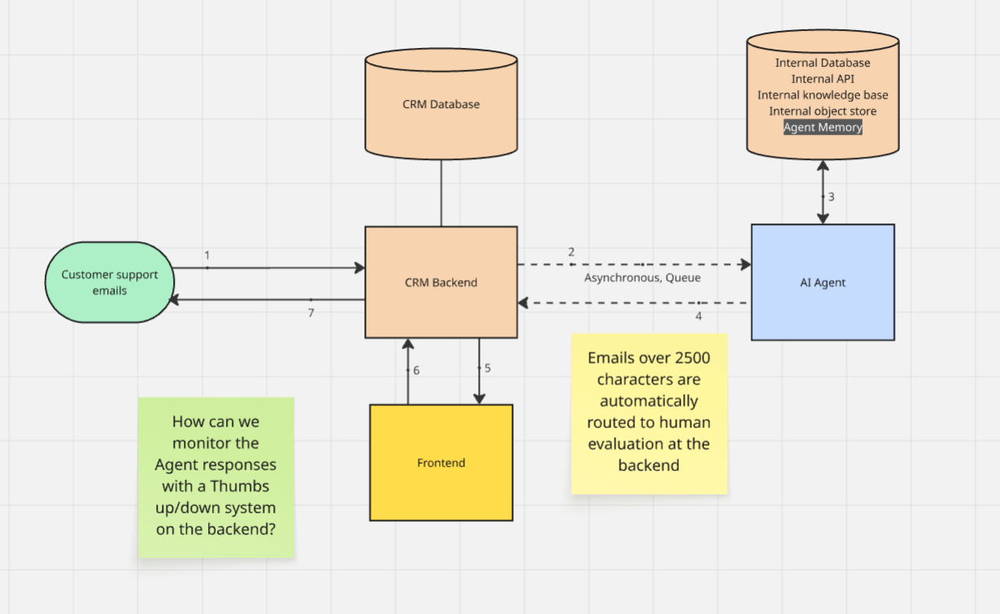
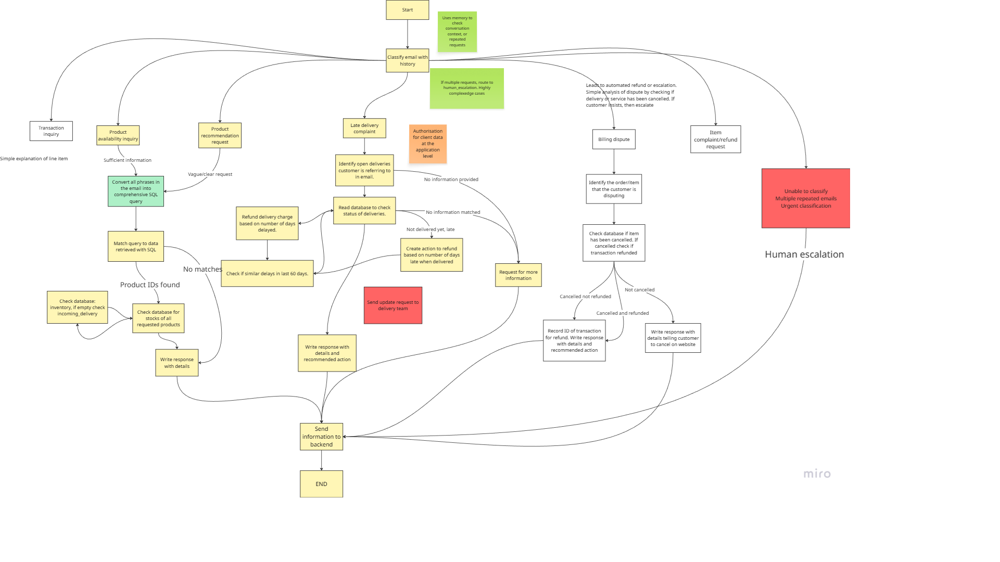
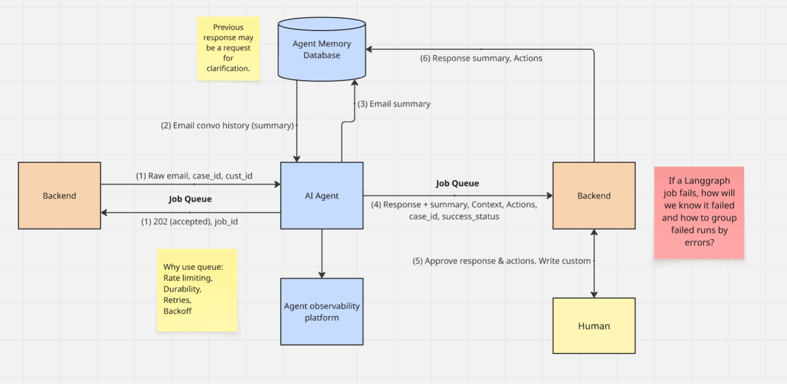
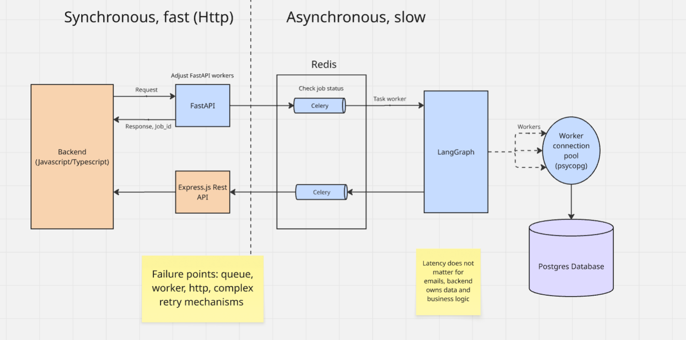
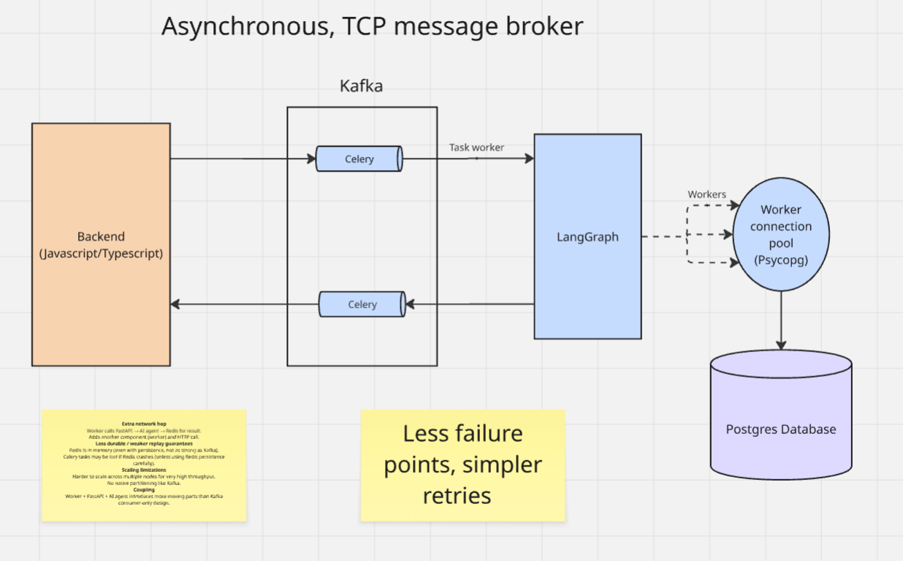
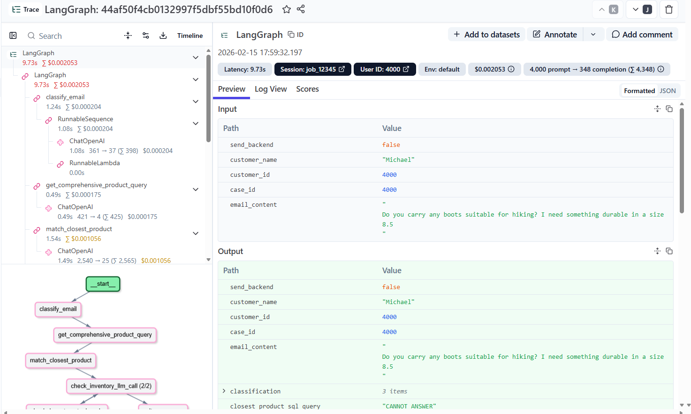

# **CRM-Mail-Agent technical documentation**
## Introduction
A fullstack agent system for an athletic footwear Ecommerce business that responds to customer service & support (post-sale) emails and takes appropriate actions with *human-in-the-loop and agent memory* and a **robust agent evaluation framework** (details in Agent evaluation framwork.md). 

Some of the features include:

- Answer product inquiries, recommend products, check stocks and incoming deliveries
- Respond to late delivery complaints, check delivery histories, credit fee refunds, provide coupons to aggrieved customer for customer retention
- HITL for all actions and responses, agent runs asynchronously in real-time through a task queue
- Memory with context compression to understand email history context while reducing token cost
- Data authorisation at the app level so no breach of data when responding to client, database query limits to prevent malicious system attacks
- OpenAI models used change depending on the difficulty of the task to save cost
- *LangFuse* used for LLM monitoring

## Problem statement
In the world of enterprise, customer service is a critical part of business and is necessary to sustain customer satisfaction and ensure customer retention. Word-of-mouth reviews of a business heavily affect its reputation and thus it is essential for any business to develop and maintain effective customer service function. Customer service or customer support is typically handled on a case by case basis with the affected party submitting a support request to a dedicated customer service department which is then left to manual human effort to follow through. This process is often time-consuming, requires insight into company data, and specialised knowledge of internal operations. When the size of a business scales up, the number of customer support cases scale accordingly, thus a vast number of human time and effort is required to maintain effective customer service. 

In such scenarios where the volume of incoming cases is higher than normal levels, customer service is known to be notoriously slow and can take weeks to respond to a customer or for a case to be resolved. *Slow response times* will negatively affect customer satisfaction and thus customer engagement and customer lifetime value.

There is potential to use AI agents to automate the process of handling individual customer service cases while handling ongoing communication with the client. AI agents have access to the company's data and business logic can be incorporated into their workflows through various AI/software engineering methods so they can be effective at managing customer service cases.

## Difficulties/Pain points of a CRM AI agent system
- For an Ecommerce business, customer support covers a multitide of different scenarios and the system has to effectively handle all of them correctly. An incorrectly handled case is a disaster for customer relations and business.
- It is essential to ensure that responses and actions taken by the agent are consistently correct and do not harm internal systems, but it is difficult to implement an automated solution for evaluating the correctness of every response. An LLM as an automated evaluator (optimiser-reflector agent pattern) is not completely reliable due to the critical requirment of response correctness.
- If there is a surge of customer support cases at a single point of time, the system be overloaded and reach failure due to the high volume of requests. It has to respond to them in less time that a customer support team of equivalent cost with the same level of quality to justify building such a system.
- There are security risks of unauthorised data leaks, and customer attempting to use emails with malicious/nefarious content to steal data or create system failure.
- Customer email support cases often span across a conversation of back-and-forth emails. Customer responses may be incomplete, lack important details, clipped and thus out-of-context without the entire conversation, redundant, or not require a response (E,g,: Thank you for the help!). This requires a robust and detailed system of handle these emails in context while ensuring that system resources (and thus cost) are not wasted/ineffecient in handling these cases.
- In the event of poor system performance due to AI related behaviour (drift or embedded), there must be effective measures to detect and understand the causes of poor performance, and there must also be solutions to fix and address these AI-related issues. There should also be measures to measure customer service effectiveness and increase it.

# System design and decisions
## High level design
To address the first major issue of the inherent risk of an AI agent sending erroneous email responses/taking incorrect actions, my design incorporates Human-in-the-loop evaluation by a qualified customer service staff for every execution after the agent completes it workflow. The bulk of the work of customer service is in investigating the issue (understanding the problem, looking at internal data, making calculations, understanding the context of the support case); the Agent handles all of this legwork while the customer agent reviews the output and decides whether to approve the email response/recommended actions, which is a fraction of the work compared to a the largely manual effort design that is present in modern CRM systems. The human is provided with the observations made by the agent(data, email conversation history, etc...) as context after its run, and based on this context the human has information to decide whether to approve or edit the response/recommended actions. This ensures both highly effective and correct customer service while significantly eliminating the amount of human effort/work required, which will increase the scalability of customer service efforts in a growing enterprise.

>*Furthermore, the addition of a human expert in this product workflow enables ongoing AI performance review though the use of a "Thumbs up/down" interface to tag the outputs of the Agent at the case and job level. This manual labelling action creates a dataset that is instrumental for understanding poor system performance, and improving the AI's performance through various forms of parameteric (fine-tuning) and non-parametric (n-shot learning, reflection agents) agent learning.*

1. Customer sends email to Customer Support
2. CRM receives email, sends event to Agent
3. Agent receives event, goes through entire Agent workflow involving data collection from internal systems
4. Agent prepares response and sends it to CRM
5. CRM front-end displays **email reponse with a list of actions to take and contextual data gathered from internal systems** to customer service staff
6. Staff reviews email draft and agent's actions, makes edits (optional), approves email and actions 
7. CRM sends AI prepared email response to client and takes actions

## Agent orchestration, data requirements, and human escalation
The second major problem is that customer service cases can be about a multitude of different use-cases: each with different actions the agent needs to take, and different data operations. There are a variety of design patterns that can be used to accomodate the large variety of different use-cases and actions: *simple code, single-agent systems, or multi-agent systems*. Simple code is too rigid and is unable to handle dynamic inputs or multistep planning. Single-agent systems are straightforward and simple, but require very detailed and intricate workflow designs to handle the variety of use-cases. Multi-agent systems bring many advantages including collaboration, speciliasion, parallelism, and improved resilience, and will be able to handle a variety of tasks extremely well, but are difficult to build, complex to evaluate, have higher operational cost (tokens, memory, compute), and are also not necessary for a simple automated custmer service system.

A single agent system that allocates an email to a well defined sub-workflow for each use-case suits this project well, because while there are a large variety of support cases, each one is a well-defined and narrow task that a single agent can perform well. Furthermore, each customer support case is supposed to be about a single issue and not a set of different issues that each need to be resolved together. The agent workflow will begin by classifying the use-case of the email and route it to the appropriate workflow until completion to ensure minimum risk of incorrect task completion. There will be a human escalation workflow where no actions are taken as a satefy mechanism for emails that are difficult to interpret, dangerous, or no action is required.

To handle the problem of email being incomplete or requiring further details to complete each sub-workflow, each workflow will enforce its data requirements stated at the beginning in order to progress. If they are not met, they will skip to the end and generate a reply stating that further information is required for the support case the customer wishes to receive support with. This also applies to emails with multiple support requests even though the customer is supposed to create a separate support case (*This is more suitable for a multi-agent system, where each agent handles a dedicated sub-workflow, but such emails should be extremely few and are considered as edge-cases, so they can be left to human effort*)

### Agent workflow diagram

### Classification:
This is the first workflow that classifies the email into the appropriate sub-workflow
1. Obtain conversation history from memory 
2. Classify email by topic and urgency
3. If >3 repeated requests, urgent, or no reply needed route to "human escalation" at the end of the workflow
> More than 3 emails about the same thing implies that the agent is not effectively handling the support case and requires a human to intervene

### Product availability inquiry or product recommendation request:
This workflow is customers who are inquiring about the availability of specific products or are asking for a recommendation given a specific need. As these two workflows are similar, they have been combined into a single one. This involves getting the closest matching results from the product database, comparing them with what the customer is looking for to identify specific products, and checking their availability.
1. Create a SQL query (text2sql) based on the content of the email to filter results (size, color, brand, etc...), if suitable
2. Query database. Match returned data to customer's request and identify product_ids
3. Check stocks of these products, if empty, check incoming deliveries
4. Write response to customer that these products are the closest match to what they are looking for and what their availability is (or when they will be available if no stocks)

### Late delivery complaint:
This workflow is for emails about late deliveries that could either be inquiries, requests, or complaints. It checks the customer's open deliveries to see if a matching tracking number can be found. A system to credit partial refunds for number of late days, and a offer expedited delivery coupons for customers who experience multiple late deliveries as a form of customer retention. 

1. Identify the tracking number the customer is referring to, route to response generation requesting for number to be provided if not available
2. Check each of the tracking numbers are open deliveries under the customer's id, if none found found, route to response generation saying that there is no such open delivery with the tracking number(s) provided
3. If matched, calculate the numbers of days late/not late, credit devliery fee refunds based on number of days late. If delivery is late and there was a late delivery in the last 60 days of this customer, provide coupon for expedited delivery for customer to use at the next order.
4. Write response to customer detailing the status of each open delivery's tracking number and the actions taken for that delivery
5. (WIP) Check logs from delivery providers to determine if a reason for lateness has been provided to communicate to the customer. Send request if not provided and >x days late on delivery

### Billing dispute (WIP):
This workflow is for customers who want to dispute billing items on the invoice for a delivery, or the entire invoice itself.

### Product delivery complaint (WIP):
This workflow is for customer who are complaining about the items that have been delivered.

### Send information to backend:
This is the end state of all workflows where the response and actions generated by the agent are sent to tbe backend for the human staff to approve. Case ID, email response, email response summary, context, and actions to the backend in real-time.

## Agent memory, and agent oversight 
Customer responses may also be incomplete, lack important details, clipped and thus out-of-context without the entire conversation. An impractical solution would be to pass the entire conversation into the prompt because this drastically increases LLM token input cost, and reduces the size of the model's context window which takes away essential focus on the latest email and could potentially exceed the context window limit causing the Agent to fail. I propose a long-term memory system agent that compresses the context of the communication in both directions to keep track of the ongoing context of the interaction between the customer and the support team. A smaller, cheaper OpenAI model will be used as a dedicated summarisation tool to summarise communication to place it in memory. This memory system is updated when communication has been received from the customer, and when communication has been approved and sent to the customer - it can also be used for other things like customer preferences and complaint history, but that business logic is for future features.

This diagram shows the design of the agent's memory (PostgreSQL) and how it is updated and accessed at each stage of the email conversation between Customer service and the Customer. The memory stores summaries of email communication so as to reduce token input and storage cost, thus saving on cost, latency and ensuring sufficient focus on the current email.

## Streaming vs Batch agent workloads
In the real world, the volume of incoming customer support emails are highly unpredictable and variable. Tens of thousands of emails could arrive per minute, or no emails could arrive. Due to the highly variable and unpredictable workload, I have avoided designing a batch workload system that runs at regular intervals (e.g.: hourly) in favour of an event-driven (streaming) system with rate limiting. This avoids system hardware overload when there is a surge in incoming traffic, and time is not wasted waiting for the next batch interval to begin thus ensuring that every unit of passing time is efficiently utilised to return responses to customer support requests as soon as possible. It is also important to note that there is no hard duration of when an email should be responded to, but an event-driven system ensures that it is responded to as soon as possible in order of its position in the queue.

This Agent is designed to be a streaming system that runs asynchronously by using Celery as the task queue. It uses a message broker and rate limiting to prevent system overload while being able to scale up if needed by increasing the number of task queue workers. 

While agent jobs run asynchronously, they connect to the same database server (only a single database server in this project, but multiple APIs/Databases in a real project). The repeated opening, authenticating, and closing of database connections at each job creates significant network overhead which increases latency, so connection pools are created at the celery worker level, so all the tasks run by the same worker use same the connection pool without having to open, authenticate, and close the connection at every celery task run. 

### In the first design we use:
- Celery: Task queue
- FastAPI: Rest API. Job ID is created at the Rest API endpoint and its is is sent as a response to the backend with HTTP code 202.
- Redis: Broker 

The job_id is created at the FastAPI endpoint and is returned to the backend, which could be used for searching the status of the job.

### In the improved design we use:
- Celery: Task queue
- Kafka: Message broker (pub-sub model)

This is because Kafka has less points of failure as it handles message transmission and endpoints. Uses TCP instead of HTTP which reduces latency. And has better features for message durability and high availability because it stores queued messages in disk (Zookeeper/Kraft) instead of in memory (Redis stores in memory). Redis is also prone to reach and exceed memory limits.

The entire middleware of this system architecture is now asynchronous because there are no responses like in the first design. In order to use a job_id to identify the current status of a job, it has to be assigned at the publisher of the event (the backend) instead of at the API. 

# Security
Security in agentic systems is an essential area of focus. Due to the non-deterministic and unobserved nature of agentic systems, the risks of unintended and erroneous behaviour is everpresent and reliable security measures have to be installed to ensure safe system function. I have designed a few useful measures to counter the most important threats

## **Data leakage**:
This is when unauthorised data or large amounts of non-sensitive data (that they become sensitive) is released to customers. Either by intentional data security attacks by the customer, or by accident by the system

### Late delivery complaint workflow:
- Database read results are filtered on the customer's ID at the application level so LLM will never see data that does not belong to the client attached to the case it is handling to prevent data leakage or customers trying to steal data

### Product availability inquiry or product recommendation request:
- System returns a maximum of 500 database results (adjustable) in case a customer is attempting a data leak attack to obtain inventory of all items (e,g,: "I want to find out about the available stocks of all your shoes"). Repeated requests are flagged by the agent
- More than 3 repeated emails by the customer over a similar topic (i,e,: Inquires about the availability of every brand and size across multiple emails to get data on the entire inventory of shoes) is automatically routed to human escalation

### Backend: 
- Emails over 2500 charaters are not sent to the agent and handled manually at the backend. A customer might send an email with hundreds of identifiers or descriptions to extract data or cause system overload

## **Prompt injection:**
This is when a customer attempts to send malicious instructions or pretends to be the owner of an important role (such as system) to hijack the agent
### Classification workflow:
- Unclear/urgent/mixed-request (edge cases) emails are routed to human for evaluation and not included in the rest of the agent workflow (refer to prompt in email_agent.py)
- All actions and responses require approval by a qualified customer service staff member before execution

## **Denial of service:**
This is when the customer attempts to send multiple emails or extremely long emails with complicated instructions to consume system resources and disrupt system operation.

### Backend: 
- Emails over 2500 charaters are not sent to the agent and handled manually at the backend. A customer might send an extremely long and complicated email and cause system overload
- Emails with repeated >3 request within the same case (same case_id) are routed to human evaluation because >3 similar requests in an email conversation means the agent is not effectively handling the customer service request

## Observability and diagnosing

LangFuse has built-in support for the LangChain ecosystem so integration is quite straightforward - define a callback handler object and use it as an argument in the langchain/graph app configuration. Each LangGraph call is monitored by Langfuse at the Trace/Session/User level and can be used for further analysis.
Trace data:
- Nodes traversed in graph 
- State input and output
- Token count
- Attempt number
- Overall latency
- Timestamp
- Cost/tokens/latency/prompt of each API call

Does not trace:
- Terminal output at each Run of LangGraph

Identifier data captured at each trace:
- Agent job ID
- Case ID
- Customer ID
- Additional metadata

## Error handling and retries
Errors in this application can occur at: *the message broker, the queue, or the agent application*. If agent task runs successfully, the response is sent back as a mesaage to the backend. In the event of errors, error handling with retries occurs at the queue and agent app, Redis in its default settings does not have features for message durability but Kafka's zookeeper/KRAFT protocol do. 

FastAPI sends back apprioriate HTTP codes to indicate errors if being used (currently set as 503).

In the event of failure of a task, the error messages are reflected in the following areas:
- Langfuse: only the error message with no system trace
- System logs: Cloudwatch or ELK (not yet implemented)
- Sent to backend as a message: and the trace of the failed program execution is sent back to the backend via the on_failure() method of the `BaseTaskWithRetry` class in `agent_queue_tasks.py`

# **To do list**
>Send update request to delivery team on "Late delivery complaint" workflow if delivery is >2 days late and there is no update from service provider

>Create a more graceful workflow for multiple requests (multi-agent system), but requires robust evaluation.

>Implement terminal output log storage (possibly with ELK stack or AWS cloudwatch) as Langfuse does not trace the full terminal output which is instrumental in debugging errors

>Move LangFuse callback handler instantiation to the Celery Entrypoint so that the callback handler is reused at the worker level, currently at agent_entrypoint.py. Until it is, Langfuse tracing is unsuitable for production

>Add email categorisation data to LangFuse metadata for error analytics