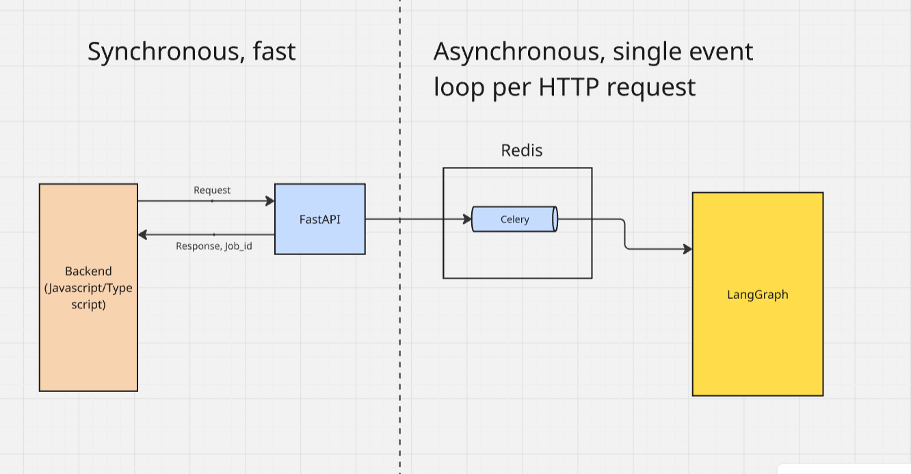

# **CRM-Mail-Agent**
A fullstack agent system for an athletic footwear Ecommerce business that responds to emails and takes appropriate actions with human-in-the-loop and agent memory and a robust agent evaluation framework. Uses Langfuse for monitoring.

- Fully integrated memory system with context compression that can respond to emails in context while reducing token cost
- Answer product inquiries, recommend products, check stocks and incoming deliveries
- Respond to late delivery complaints, check delivery histories, credit fee refunds, provide coupons for retention
- HITL for all actions and responses, agent runs asynchronously in real-time
- Data authorisation at the app level so no breach of data when responding to client

## System diagram

1. Customer sends email to Customer Support
2. CRM receives email, sends event to Agent
3. Agent receives event, goes through entire Agent workflow involving data collection from internal systems
4. Agent prepares response and sends it to CRM
5. CRM displays email with a list of actions taken and contextual data gathered from internal systems to internal staff
6. Staff reviews email draft, approves email
7. CRM sends AI prepared email response to client

## Agent memory system

This diagram shows how the agent's memory is updated and accessed at each stage of the email conversation between Customer service and the Customer. The memory stores summaries of emails so as to reduce LLM token input and save cost when memory is used.

## Agent workflow diagram

## Python frameworks

